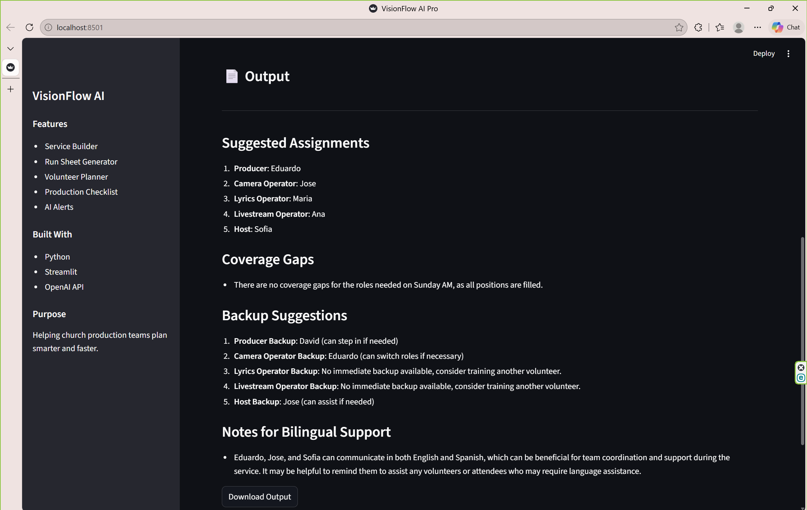

# 🎛️ VisionFlow AI Pro


AI Smart Church Production Assistant built with Python, Streamlit, and OpenAI.

---

## 🚀 Overview

**VisionFlow AI Pro** is an AI-powered application designed to assist church production teams in planning and managing services efficiently.

It combines artificial intelligence with real-world digital media workflows to generate structured service plans, production run sheets, volunteer assignments, checklists, and risk alerts.

The system supports **English, Spanish, and bilingual output**, making it accessible for diverse teams.

---

## 📸 Screenshots

  


---

## 🔥 Features

- 🎤 **Service Builder**
  - Generates complete church service plans based on sermon details

- 🎬 **Run Sheet Generator**
  - Creates structured production workflows for media teams

- 👥 **Volunteer Planner**
  - Assigns roles and identifies coverage gaps

- ✅ **Production Checklist**
  - Provides pre-service, live, and post-service checklists

- ⚠️ **AI Alerts**
  - Detects potential risks in planning and staffing

- 🌎 **Bilingual Support**
  - Output in English, Spanish, or both

- 📥 **Downloadable Results**
  - Export generated content as text files

---

## 🧠 What This Project Solves

Church production teams often rely on manual coordination between:
- Pastors
- Media operators
- Camera teams
- Livestream teams
- Volunteers

VisionFlow AI automates this process by:
- Reducing planning time
- Improving coordination
- Preventing mistakes
- Providing structured workflows

---

## 🛠️ Tech Stack

- Python
- Streamlit
- OpenAI API
- Pandas
- python-dotenv

---

## 📁 Project Structure

```text
visionflow-ai/
│── app.py
│── requirements.txt
│── .gitignore
├── assets/
│   ├── dashboard.png
│   └── service_output.png
├── data/
│   └── team_members.csv
├── modules/
│   ├── __init__.py
│   ├── ai_client.py
│   ├── service_builder.py
│   ├── run_sheet.py
│   ├── volunteer_planner.py
│   ├── checklist_generator.py
│   └── alerts.py


```
## ▶️ How to Run (Step-by-Step)


### 1. Clone the Repository
```bash
git clone https://github.com/Cabrera9114/visionflow-ai.git
cd visionflow-ai

```
### 2. Create a Virtual Environment
```bash
python -m venv venv

```
### 3. Activate the Virtual Environment

Windows (PowerShell):
```bash
.\venv\Scripts\Activate.ps1

```
Mac/Linux:
```bash
source venv/bin/activate


```
### 4. Install Dependencies
```bash
pip install -r requirements.txt

```
### 5. Set Up Environment Variables

Create a .env file in the root folder and add:
```bash
OPENAI_API_KEY=your_api_key_here

```
### 6. Run the Applications
```bash
streamlit run app.py


```
### 7. Open in Browser
If it does not open automatically, go to:
```bash
http://localhost:8501


```
## 👨‍💻 Author

Eduardo Cabrera-Lopez
AI Student | Digital Media Experience | Aspiring AI Engineer